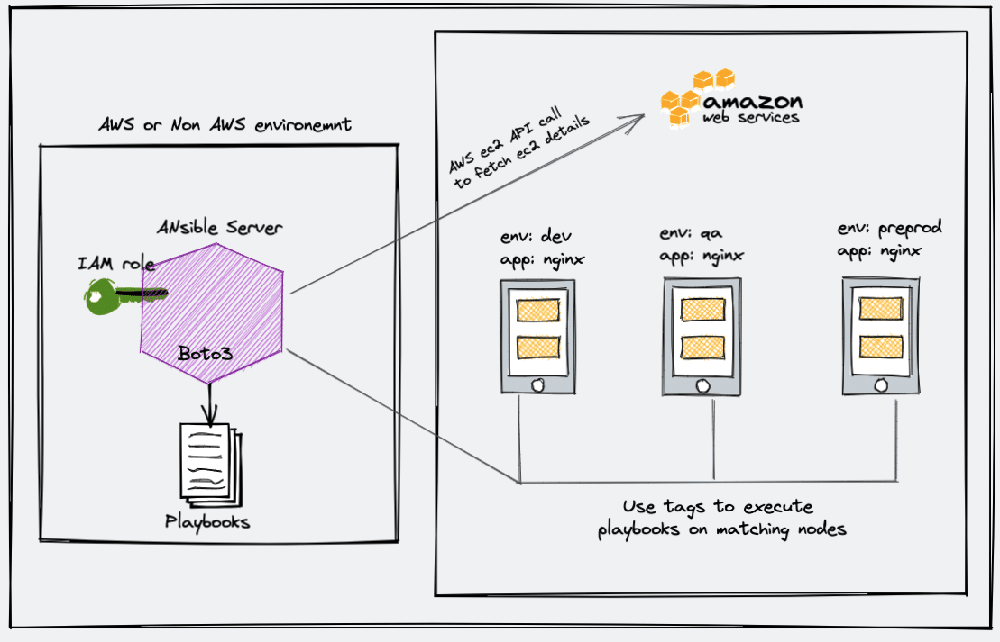

# Ansible AWS Dynamic Inventory Example

When you are using Ansible with AWS, maintaining the inventory file will be a hectic task as AWS has frequently changed IPs, autoscaling instances, and much more.

However, there is an easy solution called ansible dynamic inventory. Dynamic inventory is an ansible plugin that makes an API call to AWS to get the instance information in the run time. It gives you the ec2 instance details dynamically to manage the AWS infrastructure.

