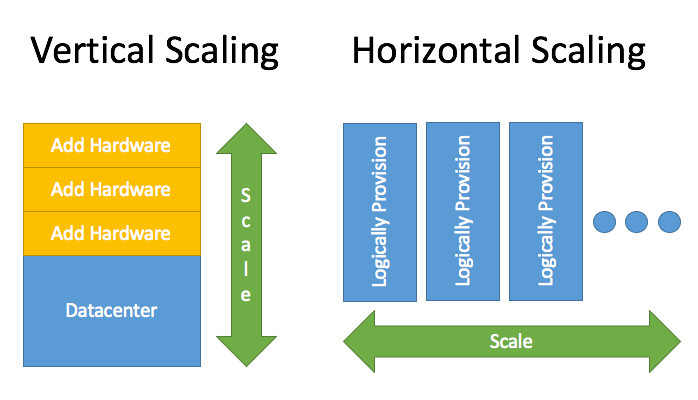

# Scalability

> the capacity to be changed in size or scale.

Scalability is the property of a system to handle a growing amount of work by adding resources to the system. It describes a system’s elasticity. While we often use it to refer to a system’s ability to grow, it is not exclusive to this definition. We can scale down, scale up, and scale out accordingly.

## Content

- [Scalability](#scalability)
  - [Content](#content)
  - [Usage of scalability](#usage-of-scalability)
  - [Types of scaling](#types-of-scaling)
    - [Vertical scaling](#vertical-scaling)
      - [Advantages of vertical scaling](#advantages-of-vertical-scaling)
      - [Disadvantages of vertical scaling](#disadvantages-of-vertical-scaling)
    - [Horizontal scaling](#horizontal-scaling)
      - [Advantages of horizontal scaling](#advantages-of-horizontal-scaling)
      - [Disadvantages of horizontal scaling](#disadvantages-of-horizontal-scaling)

// TODO

- Types of scaling
  - Vertical scaling
  - Horizontal scaling
- Caching
- Load Balancers
- Database
  - Replication
  - Partitioning
- Asynchronism

Scalability is the measure of a system’s ability to increase or decrease in performance and cost in response to changes in application and system processing demands. Examples would include how well a hardware system performs when the number of users is increased, how well a database withstands growing numbers of queries, or how well an operating system performs on different classes of hardware. Enterprises that are growing rapidly should pay special attention to scalability when evaluating hardware and software.

scalability describes system’s ability to adapt to change and demand. Good scalability protects you from future downtime and ensures the quality of your service.

---

## Usage of scalability

- The ability of a computer application or product (hardware or software) to continue to function well when it (or its context) is changed in size or volume in order to meet a user need. Typically, the rescaling is to a larger size or volume. The rescaling can be of the product itself (for example, a line of computer systems of different sizes in terms of storage, RAM, and so forth) or in the scalable object's movement to a new context (for example, a new operating system).

> An example: John Young in his book Exploring IBM's New-Age Mainframes describes the RS/6000 SP operating system as one that delivers scalability ("the ability to retain performance levels when adding additional processors"). Another example: In printing, scalable fonts are fonts that can be resized smaller or larger using software without losing quality.

- It is the ability not only to function well in the rescaled situation, but to actually take full advantage of it. For example, an application program would be scalable if it could be moved from a smaller to a larger operating system and take full advantage of the larger operating system in terms of performance (user response time and so forth) and the larger number of users that could be handled.

It is usually easier to have scalability upward rather than downward since developers often must make full use of a system's resources (for example, the amount of disk storage available) when an application is initially coded. Scaling a product downward may mean trying to achieve the same results in a more constrained environment.

---

## Types of scaling

Capacity planning is a challenge that every engineering team faces when it comes to ensuring the right resources are in place to handle expected (and unexpected) traffic demands. When demand for your application or website is increasing and you need to expand its accessibility, storage power, and availability levels, is it better to scale horizontally or vertically?

That decision depends on a number of factors. Is request volume steadily growing and/or is the current growth experiencing spikes that lead to service degradation. These types of considerations, coupled with an application’s unique make-up, need to be evaluated when determining the optimal scaling approach.

Scaling horizontally and scaling vertically are similar in that they both involve adding computing resources to your infrastructure. There are distinct differences between the two in terms of implementation and performance.

> Horizontal scaling means scaling by adding more machines to your pool of resources (also described as “scaling out”), whereas vertical scaling refers to scaling by adding more power (e.g. CPU, RAM) to an existing machine (also described as “scaling up”).

One of the fundamental differences between the two is that horizontal scaling requires breaking a sequential piece of logic into smaller pieces so that they can be executed in parallel across multiple machines. In many respects, vertical scaling is easier because the logic really doesn’t need to change. Rather, you’re just running the same code on higher-spec machines. However, there are many other factors to consider when determining the appropriate approach.

### Vertical scaling

Vertical scaling (aka scaling up) describes adding additional resources to a system so that it meets demand. How is this different from horizontal scaling? 

While horizontal scaling refers to adding additional nodes, vertical scaling describes adding more power to your current machines. For instance, if your server requires more processing power, vertical scaling would mean upgrading the CPUs. You can also vertically scale the memory, storage, or network speed.

Additionally, vertical scaling may also describe replacing a server entirely or moving a server’s workload to an upgraded one.

#### Advantages of vertical scaling

- Cost-effective - Upgrading a pre-existing server costs less than purchasing a new one. Additionally, you are less likely to add new backup and virtualization software when scaling vertically. Maintenance costs may potentially remain the same too.
- Less complex process communication - When a single node handles all the layers of your services, it will not have to synchronize and communicate with other machines to work. This may result in faster responses.
- Less complicated maintenance - Not only is maintenance cheaper but it is less complex because of the number of nodes you will need to manage. 
- Less need for software changes - You are less likely to change how the software on a server works or how it is implemented.

#### Disadvantages of vertical scaling

- Higher possibility for downtime - Unless you have a backup server that can handle operations and requests, you will need some considerable downtime to upgrade your machine. 
- Single point of failure - Having all your operations on a single server increases the risk of losing all your data if a hardware or software failure was to occur. 
- Upgrade limitations - There is a limitation to how much you can upgrade a machine. Every machine has its threshold for RAM, storage, and processing power.

### Horizontal scaling

Horizontal scaling (aka scaling out) refers to adding additional nodes or machines to your infrastructure to cope with new demands. If you are hosting an application on a server and find that it no longer has the capacity or capabilities to handle traffic, adding a server may be your solution.

It is quite similar to delegating workload among several employees instead of one. However, the downside of this may be the added complexity of your operation. You must decide which machine does what and how your new machines work with your old machines. 

You can consider this the opposite of vertical scaling.

#### Advantages of horizontal scaling

- Scaling is easier from a hardware perspective - All horizontal scaling requires you to do is add additional machines to your current pool. It eliminates the need to analyze which system specifications you need to upgrade.
- Fewer periods of downtime - Because you’re adding a machine, you don’t have to switch the old machine off while scaling. If done effectively, there may never be a need for downtime and clients are less likely to be impacted.
- Increased resilience and fault tolerance - Relying on a single node for all your data and operations puts you at a high risk of losing it all when it fails. Distributing it among several nodes saves you from losing it all. 
- Increased performance - If you are using horizontal scaling to manage your network traffic, it allows for more endpoints for connections, considering that the load will be delegated among multiple machines.     

#### Disadvantages of horizontal scaling

- Increased complexity of maintenance and operation - Multiple servers are harder to maintain than a single server is. Additionally, you will need to add software for load balancing and possibly virtualization. - - 
- Backing up your machines may also become a little more complex. You will need to ensure that nodes synchronize and communicate effectively. 
- Increased Initial costs - Adding new servers is far more expensive than upgrading old ones.

